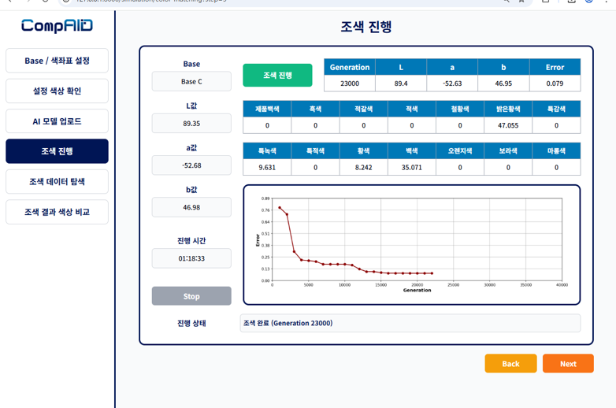
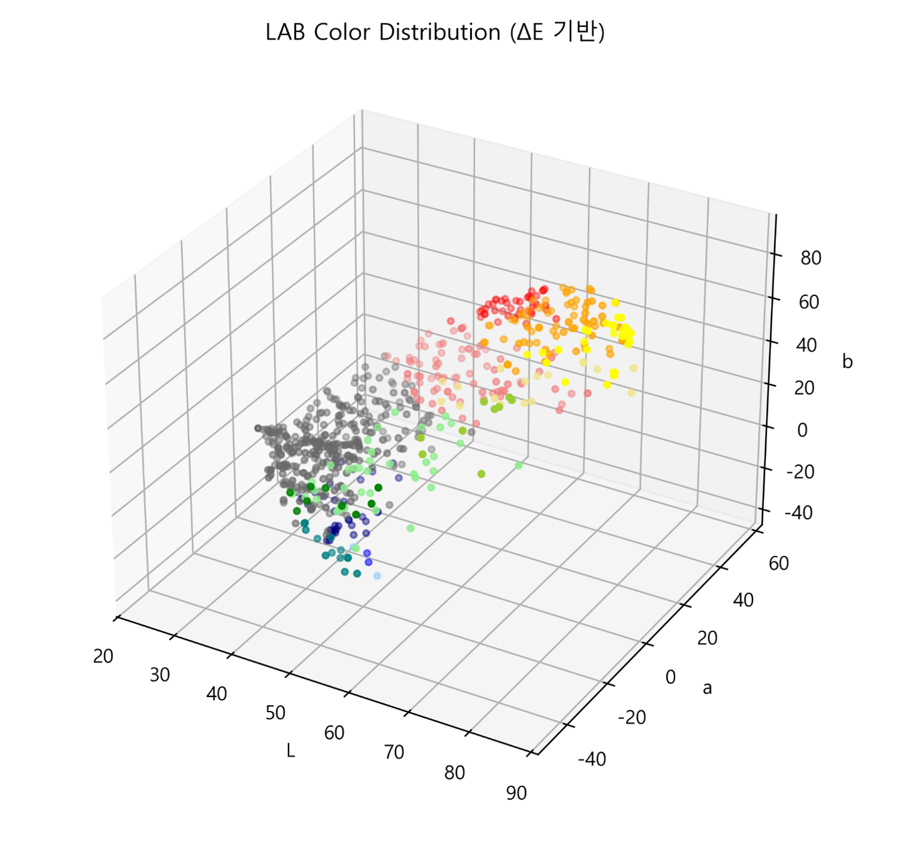
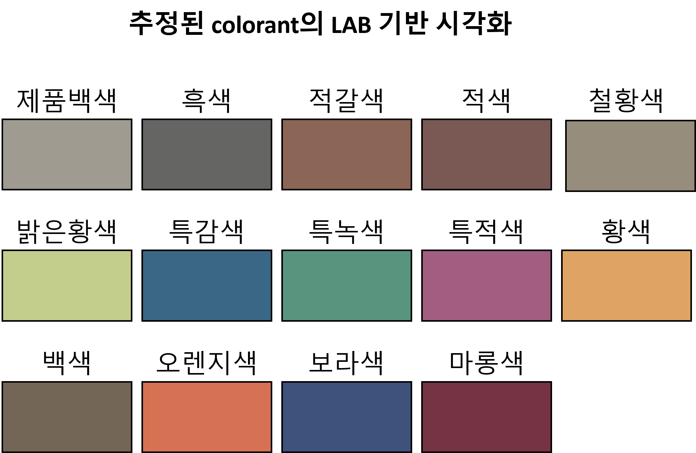
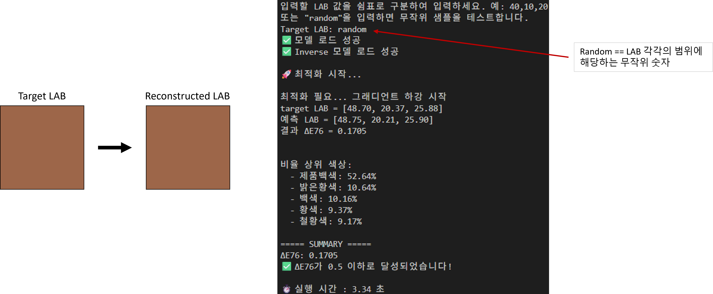
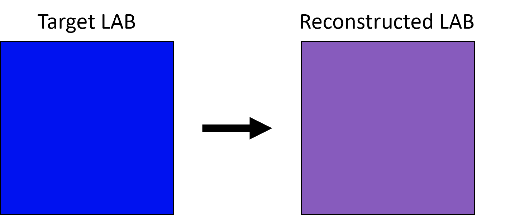

# Paint Color Formulation AI

> 목표 LAB 색상값으로부터 14개 조색제의 배합 비율을 예측하는 AI 기반 페인트 조색 모델

(주)컴파이드에서 페인트 회사와 협업하여 진행한 조색 AI 모델 개발 프로젝트입니다.

조색제별 개별 색상 정보가 제공되지 않는 환경에서, 실제 조색 결과인 LAB 값과 배합 비율만을 이용해 조색제의 색상 표현을 추정하고 목표 색상을 재현할 수 있는 배합 비율을 예측했습니다.

## 프로젝트 배경



기존 조색 과정은 목표 색상에 가까운 배합을 찾기 위해 반복적인 실험과 보정이 필요했습니다. 기존 회사 모델 역시 높은 오차를 최적화 방식으로 수렴시키는 구조여서 결과를 얻는 데 약 1시간 30분에서 2시간이 소요되었습니다.

이 프로젝트는 조색 문제를 다음과 같은 inverse problem으로 재정의했습니다.

```text
목표 LAB
  ↓
조색제 배합 비율 예측
  ↓
예측 비율로 LAB 재구성
  ↓
목표 LAB와의 색차 최소화
```

단순히 정답 배합 비율을 모방하는 대신, 예측한 배합으로 만들어지는 색상이 목표 LAB에 가까워지도록 모델을 구성했습니다.

## 데이터

학습 데이터에는 다음 정보가 포함되어 있었습니다.

- 조색 후 측정된 최종 LAB 값
- 14개 조색제의 배합 비율
- C, D, M, P의 4개 베이스 정보
- 배합 비율의 합이 약 100인 조색 결과

가장 큰 제약은 14개 조색제 각각의 개별 LAB 정보가 제공되지 않았다는 점입니다.

### 데이터 분포의 한계

학습 데이터를 LAB 색공간에서 분석한 결과, 데이터가 특정 색상 영역에 집중되어 있었습니다.



- 무채색과 저채도 영역의 데이터는 비교적 밀집
- 선명한 색상처럼 a, b 절댓값이 큰 영역은 상대적으로 희소
- 특히 진한 파란색, 진한 보라색, 짙은 녹색 계열의 표본이 부족
- LAB 색공간 전체를 균일하게 학습하기 어려운 불균형 데이터 구조

<!-- 여기에 베이스 C 학습 데이터의 LAB 색상 분포 이미지 삽입 -->

이러한 데이터 불균형은 색상 영역에 따른 모델 성능 차이로 이어졌습니다. 데이터가 충분한 영역에서는 `ΔE 0.01 이하`의 낮은 오차도 확인했지만, 학습 표본이 부족한 진한 파란색·보라색 영역에서는 모델이 색 혼합 관계를 충분히 학습하지 못해 오차가 크게 증가했습니다.

## 전체 모델 구조

```text
조색 결과 데이터
  ↓
14개 조색제의 초기 LAB 추정
  ↓
베이스별 조색제 표현 보정
  ↓
ratio → LAB Forward Model 학습
  ↓
Forward Model 고정
  ↓
LAB → ratio Inverse Model 학습
  ↓
Gradient Optimization
  ↓
필요 시 Global Search
  ↓
최종 배합 비율 + 재구성 LAB
```

## 1. 조색제 색상 표현 추정

개별 색상 정보가 없는 14개 조색제의 LAB 표현을 데이터로부터 추정했습니다.

- 특정 조색제의 비율이 높은 샘플 선별
- 선별된 샘플의 LAB 중앙값으로 초기 표현 추정
- 샘플이 부족하면 해당 조색제 비율이 높은 상위 샘플 사용
- 동일 배합 그룹 내 LAB 편차가 큰 이상치 제거
- Kubelka–Munk 이론에서 착안한 혼합 방식과 최적화를 이용한 초기값 보정
- 학습 가능한 colorant tensor와 residual network를 이용한 베이스별 추가 보정
- C, D, M, P 베이스별 14개 조색제 LAB 저장

### 조색제 색상 표현 추정 결과

 

발표 자료 기준으로 추정된 조색제 LAB의 평균 오차는 약 `ΔE 0.01394`, 최대 오차는 약 `ΔE 0.03004`였습니다.

## 2. Forward Model: ratio → LAB

조색제 배합 비율을 입력받아 결과 LAB 값을 예측하는 forward model을 먼저 학습했습니다.

```text
14개 조색제 배합 비율 → Forward Model → LAB
```

### 주요 특징

- C, D, M, P 베이스별 데이터 분포 분석
- 희소 색상 데이터를 학습 데이터에 포함하도록 분할
- Isolation Forest를 이용한 이상치 분석
- L과 a·b를 분리해 예측하는 신경망 구조 비교
- 기본 모델, 깊은 정규화 모델, 가중 손실, feature engineering 및 seed ensemble 비교
- ΔE76과 ΔE2000을 이용한 모델 평가

최종 inverse 파이프라인은 C 베이스의 특성을 학습한 forward model을 고정된 simulator로 사용합니다.

## 3. Inverse Model: LAB → ratio

학습된 forward model의 가중치를 고정한 뒤, 목표 LAB로부터 14개 조색제의 배합 비율을 예측하는 inverse model을 학습했습니다.

```text
목표 LAB → Inverse Model → 배합 비율 → 고정된 Forward Model → 재구성 LAB
```

LAB 입력은 다음과 같은 9차원 비선형 특징으로 확장했습니다.

```text
L, a, b, L×a, L×b, a×b, L², a², b²
```

출력에는 Softmax를 적용하여 14개 조색제 비율의 합이 1이 되도록 구성했습니다.

학습 손실은 다음 요소를 결합했습니다.

- ΔE76
- ΔE2000
- 배합 비율의 과도한 분산을 줄이기 위한 entropy regularization

## 4. 후처리 최적화

inverse model의 초기 예측이 목표 오차를 만족하지 못하면 배합 비율을 추가로 최적화합니다.

```text
Inverse Model 초기 비율
  ↓
Forward Model로 LAB 재구성
  ↓
ΔE76 < 0.5 ?
  ├─ Yes → 결과 반환
  └─ No  → Multi-start Gradient Optimization
              ↓
          여전히 ΔE76 > 0.5 ?
              ├─ No  → 결과 반환
              └─ Yes → Differential Evolution 기반 Global Search
```

이 구조를 통해 신경망의 빠른 초기 예측과 최적화 알고리즘의 정밀 보정을 결합했습니다.

## 모델 출력 예시



예시에서는 입력 LAB `[96.25, -22.434, 77.709]`에 대해 다음 배합을 예측했습니다.

| 조색제 | 예측 비율 |
| --- | ---: |
| 제품백색 | 41.54% |
| 흑색 | 12.15% |
| 특녹색 | 10.13% |
| 특적색 | 11.66% |
| 보라색 | 24.52% |

재구성된 LAB는 `[96.35, -22.53, 77.63]`으로, 목표 색상과 유사한 결과를 확인했습니다.

## 모델 성능과 한계 사례

모델 성능은 목표 색상이 학습 데이터 분포 안에 충분히 포함되어 있는지에 따라 큰 차이를 보였습니다.

### 데이터가 충분한 색상 영역

- 목표 색상과 유사한 조색 사례가 충분히 존재
- forward model이 조색제 비율과 LAB 사이의 관계를 안정적으로 학습
- 일부 검증 사례에서 `ΔE 0.01 이하`의 매우 낮은 오차 확인
- 협력사 목표 기준인 `ΔE76 ≤ 0.5`를 만족하는 결과 다수 확인

### 데이터가 부족한 색상 영역



진한 파란색과 진한 보라색처럼 학습 데이터가 희소한 영역에서는 목표 색상을 제대로 재구성하지 못하는 한계가 나타났습니다.

<!-- 여기에 진한 파란색 및 보라색 영역의 모델 성능 한계 이미지 삽입 -->

위 사례의 목표 LAB는 `[28.68, 61.79, -105.06]`이고, 모델이 재구성한 LAB는 `[46.93, 33.42, -45.43]`으로 `ΔE76 68.5087`이 발생했습니다. 목표 색상은 진한 파란색이지만 재구성 결과는 보라색에 가까워 색상 차이가 크게 나타났습니다.

이 결과는 특정 색상 영역의 데이터 부족이 모델의 일반화 성능을 제한할 가능성이 크다는 것을 보여줍니다. 다만 오차의 원인을 데이터 부족 하나로 단정하기보다는, 색상 영역별 표본 수와 배합 조합의 다양성, 조색제 표현 추정 오차 및 실제 색 혼합의 비선형성도 함께 영향을 줄 수 있습니다.

향후 성능 개선을 위해서는 다음 작업이 필요합니다.

- 진한 파란색·보라색·녹색 영역의 조색 데이터 추가 확보
- LAB 색공간의 희소 영역을 고려한 데이터 분할 및 가중 학습
- 색상 영역별 성능 지표와 표본 밀도의 상관관계 분석
- 희소 영역을 대상으로 한 보간·증강 또는 별도 보정 모델 검토
- 실제 도장 및 건조 후 측정값을 이용한 추가 검증

## 성과

- 조색제 개별 색정보가 없는 조건에서 14개 colorant representation 추정
- LAB → ratio → LAB 구조로 조색 문제 재정의
- forward model을 고정된 differentiable simulator로 활용
- 신경망 예측과 gradient·global optimization을 결합한 추론 파이프라인 구성
- 기존 약 1시간 30분~2시간의 탐색 과정을 일반적인 시뮬레이션 기준 1분 이내로 단축
- 데이터가 충분한 색상 영역에서 협력사 목표 기준인 `ΔE76 ≤ 0.5` 수준의 결과 확인

## 한계

- LAB 색공간의 데이터 분포가 균일하지 않고 특정 영역에 집중되어 있음
- 진한 파란색, 진한 보라색, 짙은 녹색 계열의 학습 데이터가 상대적으로 부족함
- 데이터가 충분한 영역과 희소한 영역 사이에 성능 편차가 크며, 희소 영역에서 `ΔE76 68.5087`과 같은 높은 오차가 발생함
- 베이스별 조색 특성이 다르며, 최종 LAB → ratio 추론 파이프라인은 C 베이스를 대상으로 구현됨
- 모델이 계산한 LAB와 실제 도장·건조 후 측정값 사이에는 추가적인 현장 검증이 필요함

## 기술 스택

- Python
- PyTorch
- NumPy
- Pandas
- SciPy
- Scikit-learn
- Excel-based Dataset Processing
- Kubelka–Munk-inspired Color Mixing
- Gradient-based Optimization
- Differential Evolution

## 주요 기여

- 제약이 있는 실제 산업 데이터를 분석하고 학습 문제를 재정의
- 개별 색정보 없이 조색제별 잠재 LAB 표현을 추정하는 과정 설계
- forward–inverse 결합 모델의 전체 학습 파이프라인 구현
- 색차 기반 학습 손실과 배합 비율 제약 적용
- 여러 모델 구조와 데이터 처리 방식을 비교하고 최종 구조 선정
- 추론 후 최적화 단계를 구성해 색상 재현 오차와 처리 시간 개선
- 데이터 부족 색상 영역을 분석해 모델의 한계 구간 식별

## Confidentiality Notice

본 프로젝트는 기업 협업으로 수행되었습니다. 이 저장소는 프로젝트의 기술적 접근과 성과를 소개하기 위한 Case Study 문서이며, 실제 소스 코드와 내부 디렉터리 구조는 공개하지 않습니다.

회사와 협력사의 보안 및 권리를 보호하기 위해 원본 데이터, 학습된 모델 가중치, 내부 파일명과 폴더명, 협력사 식별 정보 및 세부 구현 자료는 포함하지 않습니다.
